<!--
**TheKingOfAtlantis/TheKingOfAtlantis** is a ✨ _special_ ✨ repository because its `README.md` (this file) appears on your GitHub profile.

Here are some ideas to get you started:

- 🔭 I’m currently working on ...
- 🌱 I’m currently learning ...
- 👯 I’m looking to collaborate on ...
- 🤔 I’m looking for help with ...
- 💬 Ask me about ...
- 📫 How to reach me: ...
- 😄 Pronouns: ...
- ⚡ Fun fact: ...
-->

## Hey there 👋

🤵 _He/Him_  
🎓 Bsc Natural Sciences Graduate from the University of Bath  
🎯 Currently working on a Calendar App for Android built with Compose + Kotin  
💭 Hope to build a game on top of my own game engine

## Some of the Tech I Use
[](#)
[](#)
[](#)
[](#)

[](#)
[](#)
[](#)
[](#)

[](#)
[](#)
[](#)


[](#)
[](#)
[](#)
[](#)

### Stats Summary
<details>
<summary>Click to expand!</summary>
<!-- <div style="display:grid; grid:auto-flow/1fr 1fr 1fr;justify-content: start">
    
    
    
    
    
</div> -->


</details>
<!--START_SECTION:waka-->


**I'm a Night 🦉** 

```text
🌞 Morning                214 commits         ██░░░░░░░░░░░░░░░░░░░░░░░   06.12 % 
🌆 Daytime                1531 commits        ███████████░░░░░░░░░░░░░░   43.82 % 
🌃 Evening                1394 commits        ██████████░░░░░░░░░░░░░░░   39.90 % 
🌙 Night                  355 commits         ███░░░░░░░░░░░░░░░░░░░░░░   10.16 % 
```
📅 **I'm Most Productive on Saturday** 

```text
Monday                   310 commits         ██░░░░░░░░░░░░░░░░░░░░░░░   08.87 % 
Tuesday                  489 commits         ████░░░░░░░░░░░░░░░░░░░░░   14.00 % 
Wednesday                399 commits         ███░░░░░░░░░░░░░░░░░░░░░░   11.42 % 
Thursday                 669 commits         █████░░░░░░░░░░░░░░░░░░░░   19.15 % 
Friday                   258 commits         ██░░░░░░░░░░░░░░░░░░░░░░░   07.38 % 
Saturday                 773 commits         ██████░░░░░░░░░░░░░░░░░░░   22.12 % 
Sunday                   596 commits         ████░░░░░░░░░░░░░░░░░░░░░   17.06 % 
```


📊 **This Week I Spent My Time On** 

```text
🕑︎ Time Zone: Europe/London

💬 Programming Languages: 
Markdown                 0 secs              █████████████████████████   100.00 % 

🔥 Editors: 
VS Code                  0 secs              █████████████████████████   100.00 % 

🐱‍💻 Projects: 
Project                  0 secs              █████████████████████████   100.00 % 

💻 Operating System: 
Windows                  0 secs              █████████████████████████   100.00 % 
```

**I Mostly Code in Kotlin** 

```text
Kotlin                   4 repos             ██████░░░░░░░░░░░░░░░░░░░   22.22 % 
Python                   2 repos             ███░░░░░░░░░░░░░░░░░░░░░░   11.11 % 
Lua                      1 repo              █░░░░░░░░░░░░░░░░░░░░░░░░   05.56 % 
Shell                    1 repo              █░░░░░░░░░░░░░░░░░░░░░░░░   05.56 % 
TypeScript               1 repo              █░░░░░░░░░░░░░░░░░░░░░░░░   05.56 % 
```


 Last Updated on 13/11/2023 05:13:12 UTC
<!--END_SECTION:waka-->
