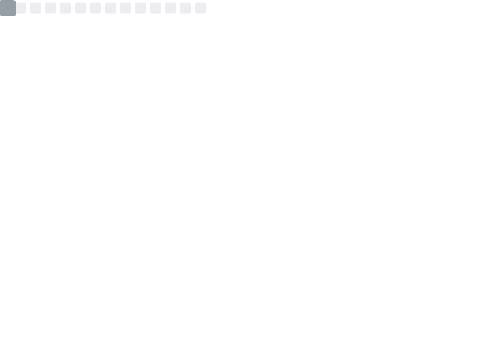
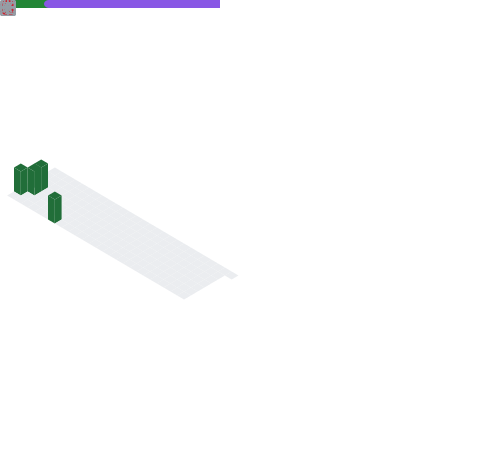
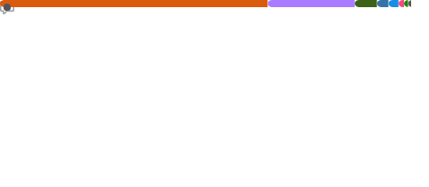

<!--
**TheKingOfAtlantis/TheKingOfAtlantis** is a ✨ _special_ ✨ repository because its `README.md` (this file) appears on your GitHub profile.

Here are some ideas to get you started:

- 🔭 I’m currently working on ...
- 🌱 I’m currently learning ...
- 👯 I’m looking to collaborate on ...
- 🤔 I’m looking for help with ...
- 💬 Ask me about ...
- 📫 How to reach me: ...
- 😄 Pronouns: ...
- ⚡ Fun fact: ...
-->

## Hey there 👋

🤵 _He/Him_  
🎓 Bsc Natural Sciences Graduate from the University of Bath  
🎯 Currently working on a Calendar App for Android built with Compose + Kotin  
💭 Hope to build a game on top of my own game engine

## Some of the Tech I Use
[](#)
[](#)
[](#)
[](#)

[](#)
[](#)
[](#)
[](#)

[](#)
[](#)
[](#)


[](#)
[](#)
[](#)
[](#)

### Stats Summary
<details>
<summary>Click to expand!</summary>
<!-- <div style="display:grid; grid:auto-flow/1fr 1fr 1fr;justify-content: start">
    
    
    
    
    
</div> -->


</details>
<!--START_SECTION:waka-->


**I'm an Early 🐤** 

```text
🌞 Morning                625 commits         ████░░░░░░░░░░░░░░░░░░░░░   15.88 % 
🌆 Daytime                1776 commits        ███████████░░░░░░░░░░░░░░   45.13 % 
🌃 Evening                1205 commits        ████████░░░░░░░░░░░░░░░░░   30.62 % 
🌙 Night                  329 commits         ██░░░░░░░░░░░░░░░░░░░░░░░   08.36 % 
```
📅 **I'm Most Productive on Sunday** 

```text
Monday                   255 commits         ██░░░░░░░░░░░░░░░░░░░░░░░   06.48 % 
Tuesday                  821 commits         █████░░░░░░░░░░░░░░░░░░░░   20.86 % 
Wednesday                417 commits         ███░░░░░░░░░░░░░░░░░░░░░░   10.60 % 
Thursday                 513 commits         ███░░░░░░░░░░░░░░░░░░░░░░   13.04 % 
Friday                   224 commits         █░░░░░░░░░░░░░░░░░░░░░░░░   05.69 % 
Saturday                 746 commits         █████░░░░░░░░░░░░░░░░░░░░   18.96 % 
Sunday                   959 commits         ██████░░░░░░░░░░░░░░░░░░░   24.37 % 
```


📊 **This Week I Spent My Time On** 

```text
🕑︎ Time Zone: Europe/London

💬 Programming Languages: 
C++                      1 hr 59 mins        █████████████████████████   99.84 % 
Other                    0 secs              ░░░░░░░░░░░░░░░░░░░░░░░░░   00.13 % 
C                        0 secs              ░░░░░░░░░░░░░░░░░░░░░░░░░   00.04 % 

🔥 Editors: 
VS Code                  1 hr 59 mins        █████████████████████████   100.00 % 

🐱‍💻 Projects: 
main                     1 hr 59 mins        █████████████████████████   100.00 % 

💻 Operating System: 
Windows                  1 hr 59 mins        █████████████████████████   100.00 % 
```

**I Mostly Code in Kotlin** 

```text
C++                      3 repos             ███░░░░░░░░░░░░░░░░░░░░░░   13.64 % 
TeX                      3 repos             ███░░░░░░░░░░░░░░░░░░░░░░   13.64 % 
CMake                    2 repos             ██░░░░░░░░░░░░░░░░░░░░░░░   09.09 % 
Python                   2 repos             ██░░░░░░░░░░░░░░░░░░░░░░░   09.09 % 
Lua                      1 repo              █░░░░░░░░░░░░░░░░░░░░░░░░   04.55 % 
```


 Last Updated on 30/06/2026 18:57:03 UTC
<!--END_SECTION:waka-->
