<!--
**TheKingOfAtlantis/TheKingOfAtlantis** is a ✨ _special_ ✨ repository because its `README.md` (this file) appears on your GitHub profile.

Here are some ideas to get you started:

- 🔭 I’m currently working on ...
- 🌱 I’m currently learning ...
- 👯 I’m looking to collaborate on ...
- 🤔 I’m looking for help with ...
- 💬 Ask me about ...
- 📫 How to reach me: ...
- 😄 Pronouns: ...
- ⚡ Fun fact: ...
-->

## Hey there 👋

🤵 _He/Him_  
🎓 Bsc Natural Sciences Graduate from the University of Bath  
🎯 Currently working on a Calendar App for Android built with Compose + Kotin  
💭 Hope to build a game on top of my own game engine

## Some of the Tech I Use
[](#)
[](#)
[](#)
[](#)

[](#)
[](#)
[](#)
[](#)

[](#)
[](#)
[](#)


[](#)
[](#)
[](#)
[](#)

### Stats Summary
<details>
<summary>Click to expand!</summary>
<!-- <div style="display:grid; grid:auto-flow/1fr 1fr 1fr;justify-content: start">
    
    
    
    
    
</div> -->


</details>
<!--START_SECTION:waka-->


**I'm a Night 🦉** 

```text
🌞 Morning                80 commits          █░░░░░░░░░░░░░░░░░░░░░░░░   02.78 % 
🌆 Daytime                1136 commits        ██████████░░░░░░░░░░░░░░░   39.49 % 
🌃 Evening                1307 commits        ███████████░░░░░░░░░░░░░░   45.43 % 
🌙 Night                  354 commits         ███░░░░░░░░░░░░░░░░░░░░░░   12.30 % 
```
📅 **I'm Most Productive on Saturday** 

```text
Monday                   181 commits         ██░░░░░░░░░░░░░░░░░░░░░░░   06.29 % 
Tuesday                  385 commits         ███░░░░░░░░░░░░░░░░░░░░░░   13.38 % 
Wednesday                385 commits         ███░░░░░░░░░░░░░░░░░░░░░░   13.38 % 
Thursday                 476 commits         ████░░░░░░░░░░░░░░░░░░░░░   16.55 % 
Friday                   226 commits         ██░░░░░░░░░░░░░░░░░░░░░░░   07.86 % 
Saturday                 631 commits         █████░░░░░░░░░░░░░░░░░░░░   21.93 % 
Sunday                   593 commits         █████░░░░░░░░░░░░░░░░░░░░   20.61 % 
```


📊 **This Week I Spent My Time On** 

```text
🕑︎ Time Zone: Europe/London

💬 Programming Languages: 
Kotlin                   6 hrs 52 mins       ████████████░░░░░░░░░░░░░   48.77 % 
TOML                     2 hrs 10 mins       ████░░░░░░░░░░░░░░░░░░░░░   15.39 % 
ActionScript             1 hr 45 mins        ███░░░░░░░░░░░░░░░░░░░░░░   12.43 % 
Ezhil                    1 hr 34 mins        ███░░░░░░░░░░░░░░░░░░░░░░   11.18 % 
Assembly                 1 hr 5 mins         ██░░░░░░░░░░░░░░░░░░░░░░░   07.73 % 

🔥 Editors: 
Android Studio           13 hrs 16 mins      ████████████████████████░   94.12 % 
VS Code                  49 mins             █░░░░░░░░░░░░░░░░░░░░░░░░   05.88 % 

🐱‍💻 Projects: 
Multitasker              13 hrs 53 mins      █████████████████████████   98.52 % 
Master's Project         12 mins             ░░░░░░░░░░░░░░░░░░░░░░░░░   01.48 % 

💻 Operating System: 
Windows                  13 hrs 53 mins      █████████████████████████   98.52 % 
Linux                    12 mins             ░░░░░░░░░░░░░░░░░░░░░░░░░   01.48 % 
```

**I Mostly Code in Kotlin** 

```text
Kotlin                   5 repos             ███████░░░░░░░░░░░░░░░░░░   27.78 % 
Shell                    2 repos             ███░░░░░░░░░░░░░░░░░░░░░░   11.11 % 
TypeScript               1 repo              █░░░░░░░░░░░░░░░░░░░░░░░░   05.56 % 
C#                       1 repo              █░░░░░░░░░░░░░░░░░░░░░░░░   05.56 % 
Python                   1 repo              █░░░░░░░░░░░░░░░░░░░░░░░░   05.56 % 
```


 Last Updated on 11/09/2023 17:12:38 UTC
<!--END_SECTION:waka-->
